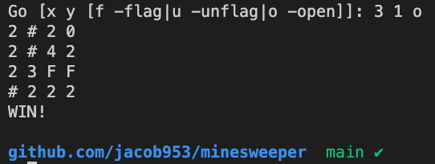
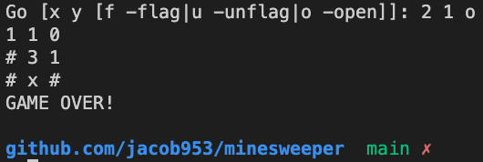

[English](/README.md) | 简体中文

# Minesweeper
> 用 Golang 实现扫雷

- [Minesweeper](#minesweeper)
  - [介绍](#介绍)
    - [截图](#截图)
  - [开始](#开始)
  - [执照](#执照)

## 介绍

这个想法来自于 VMware 对我的第二次面试。

代码结构的简要说明：
  - `cmd`: 开始扫雷游戏
  - `internal`：内部接口调用
  - `pkg`：外部接口调用
```
.
├── cmd
│   └── minesweeper.go
├── go.mod
├── internal
│   ├── cell
│   │   └── cell.go
│   └── grid
│       └── grid.go
└── pkg
    └── game.go
```

### 截图

<div>
  
  
<div>

<p align="center"><b>如果对你有用，欢迎 star 这个仓库！</b></p>

## 开始

1. 将此仓库克隆到本地，并确保 Golang 环境已经存在。
2. 进入文件夹，运行命令`go run cmd/minesweeper.go`，然后你会看到指导提示。
3. 玩得愉快～

## 执照

此仓库遵循 [Apache 许可证 2.0](/LICENSE)。