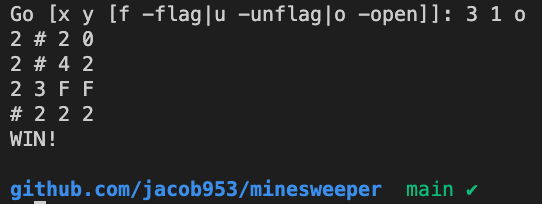
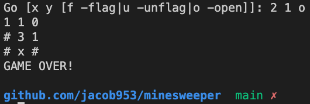

English | [简体中文](/README-zh.md)

# Minesweeper

> Minesweeper implemented by Golang

- [Minesweeper](#minesweeper)
  - [Introduce](#introduce)
    - [Screenshot](#screenshot)
  - [Start](#start)
  - [License](#license)

## Introduce

This idea begins with my second interview with VMware.

Brief description of code structure.
  - `cmd`: start the minesweeper game
  - `internal`: internal interface calls
  - `pkg`: external interface calls
```
.
├── cmd
│   └── minesweeper.go
├── go.mod
├── internal
│   ├── cell
│   │   └── cell.go
│   └── grid
│       └── grid.go
└── pkg
    └── game.go
```

### Screenshot

<div>
  
  
<div>

<p align="center"><b>Welcome to star this repo if it is useful to you!</b></p>

## Start

1. Clone this repo to your local, and make sure Golang env is existed.
2. Enter the folder, and run command `go run cmd/minesweeper.go`, then you will see tips for guide.
3. Enjoy yourself with Minesweeper implemented by Golang.

## License

This repository follows [Apache License 2.0](/LICENSE).
